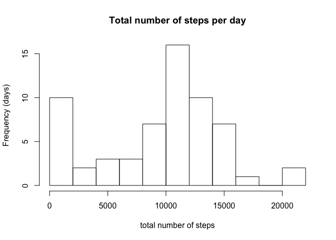
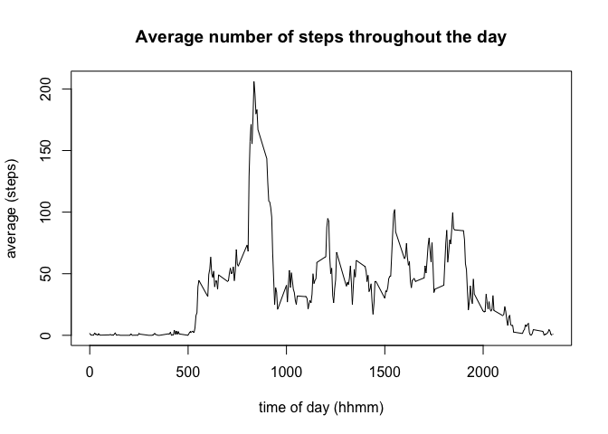
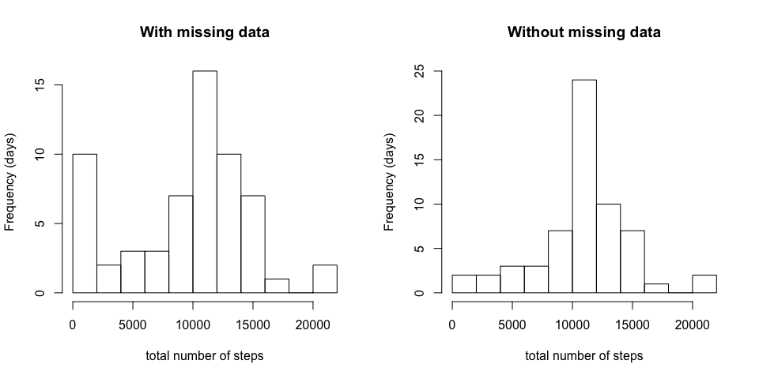
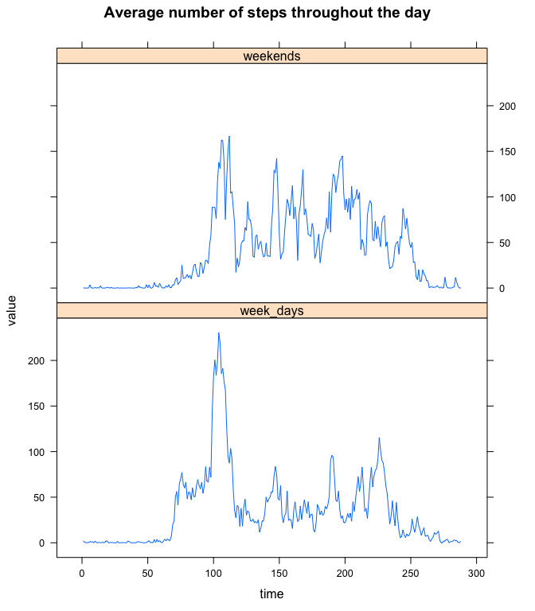

This report concerns the first Project of the Reproducible Research course.  

I was provided with data collected by a personal activity monitoring device of an anonymous subject, at 5-minute intervals throughout the day during the months of October and November 2012. This data includes the date and time at which the measure was taken, as well as the number of steps it counted.

## Loading and preprocessing the data

We start by reading and loading the data into R, and analyse some of its basic characteristics.


```r
setwd("~/Desktop/Data Science course/5. Reproducible Research/Project 1")       # my local directory
data <- read.csv('RepData_PeerAssessment1-master/activity.csv')

head(data)
```

```
##   steps       date interval
## 1    NA 2012-10-01        0
## 2    NA 2012-10-01        5
## 3    NA 2012-10-01       10
## 4    NA 2012-10-01       15
## 5    NA 2012-10-01       20
## 6    NA 2012-10-01       25
```

```r
dim(data)
```

```
## [1] 17568     3
```

Therefore, there are 17568 observations of the 3 variables I described above. The steps column has integer entries, as does the interval column where time is given on hhmm format, while the class of the date column is factor. We now convert it into date.


```r
sapply(data[,1:3], class)
```

```
##     steps      date  interval 
## "integer"  "factor" "integer"
```

```r
data$date <- as.Date(data$date)
```


## What is the average total number of steps taken per day?

As can be observed in the top of the data frame *data* above, there are many measurements of number of steps throughout the same day. We now compute the total number of steps taken on each day and plot it into a histogram.


```r
library(dplyr)
totalsteps <- data %>% group_by(date) %>% summarize(nr_steps = sum(steps, na.rm = TRUE))
    # We group the observation by date and for each date we calculate the total number of steps.

hist(totalsteps$nr_steps, breaks=10, xlab='total number of steps', ylab='Frequency (days)',
     main='Total number of steps per day')
```

<!-- -->

This histogram tells us that on most days the subject either took between 0-2000 steps or between 8000-16000 steps.  

We also calculate the mean and median of these values.


```r
summary(totalsteps$nr_steps)
```

```
##    Min. 1st Qu.  Median    Mean 3rd Qu.    Max. 
##       0    6778   10395    9354   12811   21194
```

This table shows that on average the individual took 9354 steps per day, and the median number of steps per day is 10395.


## What is the average daily activity pattern?

Instead of focussing on the total number of steps per day, we now look at each 5-minute interval separately and compute the mean of the same 5-minute interval throughout all days.


```r
newdata <- data %>% group_by(interval) %>% summarise(average = mean(steps, na.rm = TRUE))
    # We group the data by interval and for each interval take the mean of the number of steps.

plot(newdata$average ~ newdata$interval, type='l', xlab='time of day (hhmm)', ylab='average (steps)', main='Average number of steps throughout the day')
```

<!-- -->

We observe that at the early hours of the day the average number of steps is close to null, then it starts increasing and reaches the maximum value in the morning (we compute below the exact time in the day at which the maximum is attained). Throughout the rest of the day the average number of steps oscilates approximately between 50 and 100, and at the end of the day it decreases until it is almost zero again.

Let us now compute the 5-minute interval at which the average number of steps is largest.


```r
newdata$interval[ which( newdata$average == max(newdata$average) ) ]
```

```
## [1] 835
```

Assuming the values in the interval column correspond to the left endpoints of the 5-minute interval, the average number of steps is largest at 8:35-8:40.


## Imputing missing values

One problem with our data we have not addressed so far is the existence of many missing values; this could already been seen in the table at the beginning of the report.


```r
sum(is.na(data$steps))
```

```
## [1] 2304
```

More specifically there are 2304 missing values in the data set. Similarly, one can confirm that the columns date and interval contain no missing values, so all missing values of the data set appear in the steps column.

I have decided to fill each missing value in the data set with the average number of steps in the corresponding 5-minute interval; and I am saving this information into a new data set *data2*.


```r
data2 <- data
indexes <- which(is.na(data2$steps))        # indexes of missing values

for (i in indexes){
    data2[i,1] <- newdata$average[newdata$interval == data2[i,3]]
}
```

Let us now compute a histogram of the total number of steps taken each day. I am also including the histogram above, as to better compare the results before and after filling the missing data.


```r
totalsteps2 <- data2 %>% group_by(date) %>% summarize(nr_steps = sum(steps))

par(mfrow=c(1,2))

hist(totalsteps$nr_steps, breaks=10, xlab='total number of steps', ylab='Frequency (days)', main='With missing data')

hist(totalsteps2$nr_steps, breaks=10, xlab='total number of steps', ylab='Frequency (days)', main='Without missing data', ylim=c(0,25))
```

<!-- -->

```r
par(mfrow=c(1,1))
```

These histograms suggest that, after filling in the missing values, there are less days with fewer number of steps and more days with medium total number of steps. However, the numbers of days with large number of steps appears to be unchanged. This can be confirmed by investigating this data a bit further:


```r
summary(totalsteps2$nr_steps)
```

```
##    Min. 1st Qu.  Median    Mean 3rd Qu.    Max. 
##      41    9819   10766   10766   12811   21194
```

After filling in the missing values, the individual on average takes 10706 steps per day, an increase from the previous 9354 steps per day. The median remains unchanged at 10395 steps, as do the third quartile and the maximum value, which is consistent with the conclusions we drew from the histograms.


## Are there differences in activity patterns between weekdays and weekends?

We now look into whether there are any differences in the subject's activity patterns between weekdays and weekends. For this we consider the data set containing no missing data, *data2*.

I now add a new column to this data set, describing whether the date corresponds to a 'weekday' or a 'weekend' day.


```r
library(chron)      # needed for the function is.weekend

dic <- c("weekday","weekend")   # will work as a dictionary

data2$type_day <- dic[is.weekend(data2$date) + 1]
    # if the row corresponds to a week day, the result is
    # dic[is.weekend(...) + 1] = dic[FALSE + 1] = dic[1] = "weekday"
    # similarly, on weekdays we get
    # dic[is.weekend(...) + 1] = dic[TRUE + 1] = dic[2] = "weekend"

data2$type_day <- as.factor(data2$type_day)
```

We now plot the average number of steps throughout the day for week days and for weekends.


```r
meanweekdays <- data2 %>% filter(type_day == "weekday") %>% group_by(interval) %>% summarize(average = mean(steps))

meanweekends <- data2 %>% filter(type_day == "weekend") %>% group_by(interval) %>% summarize(average = mean(steps))

summary(meanweekdays$average)
```

```
##    Min. 1st Qu.  Median    Mean 3rd Qu.    Max. 
##   0.000   2.247  25.803  35.611  50.854 230.378
```

```r
summary(meanweekends$average)
```

```
##    Min. 1st Qu.  Median    Mean 3rd Qu.    Max. 
##   0.000   1.241  32.340  42.366  74.654 166.639
```

```r
library(reshape2)
all <- melt(data.frame(time = seq(1,288), week_days = meanweekdays$average,
                       weekends = meanweekends$average), id.var="time")

library(lattice)
xyplot(value~time|variable, all, type="l",
       layout=c(1,2), main='Average number of steps throughout the day')
```

<!-- -->

From the graphs and the summaries we can conclude the following:  
* on average the maximum number of steps is larger in week days, which means that the subject walks more in that short period of time during week days;  
* the mean is higher during the weekend, that is on average the subject walks more during the weekend;  
* the interquartile range is bigger during the weekend, meaning that the subject walks during more hours of the day in the weekend.
